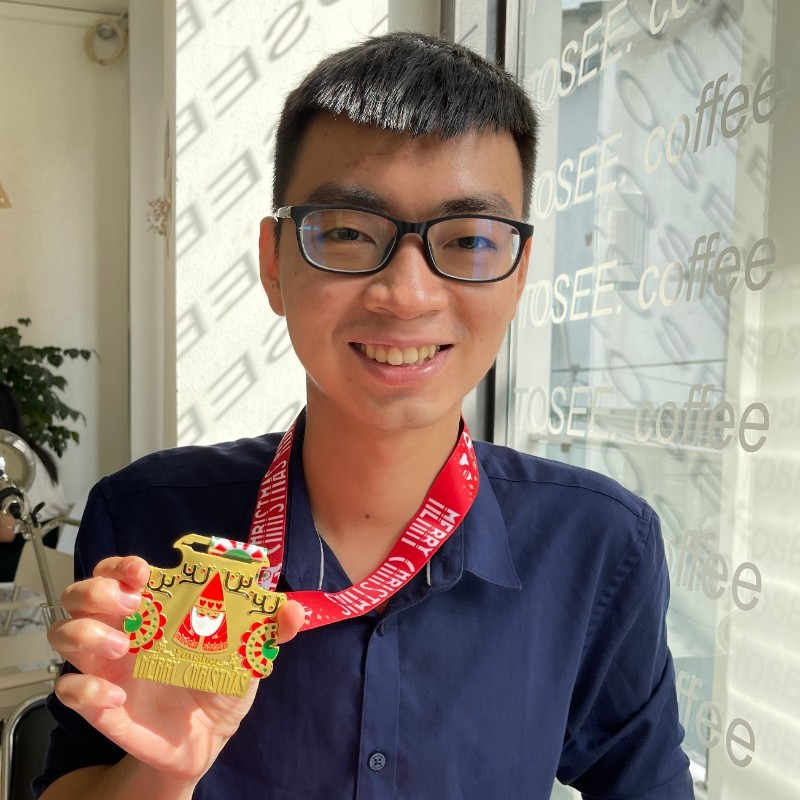

# About

{: align=left width=100px style='border-radius:40px;' }

2021 is the year for me to refresh myself, and start a new journey. I don't even know what will be happening, just believe in myself.  

## Resume

- [Resume](resume/fresherFeb2021.pdf)

## Work

### Actively applying

Feb 2021  

### Teko Vietnam

Junior Web Developer  
Oct 2018 - Oct 2019  

## Education

### Bachelor degree

Advanced Program in **Computer Science**  
2016 - 2021  
VNU HCM - University of Science  

### Phổ Thông Năng Khiếu

Major in **Informatics**  
2013 - 2016  
VNU HCM - High School for the gifted  

<!--
## Commands

* `mkdocs new [dir-name]` - Create a new project.
* `mkdocs serve` - Start the live-reloading docs server.
* `mkdocs build` - Build the documentation site.
* `mkdocs -h` - Print help message and exit.

## Project layout

    mkdocs.yml    # The configuration file.
    docs/
        index.md  # The documentation homepage.
        ...       # Other markdown pages, images and other files.
-->
